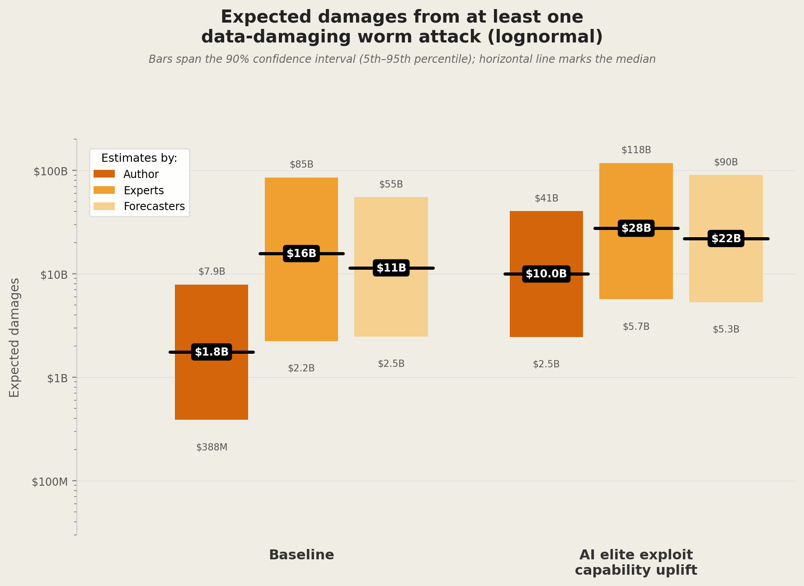
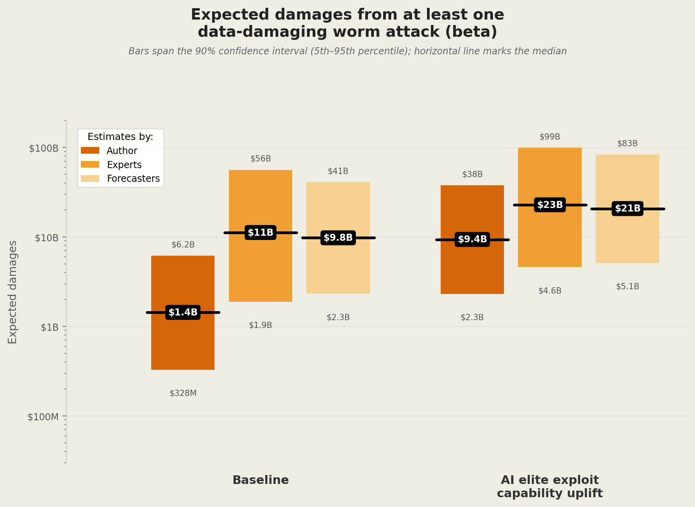
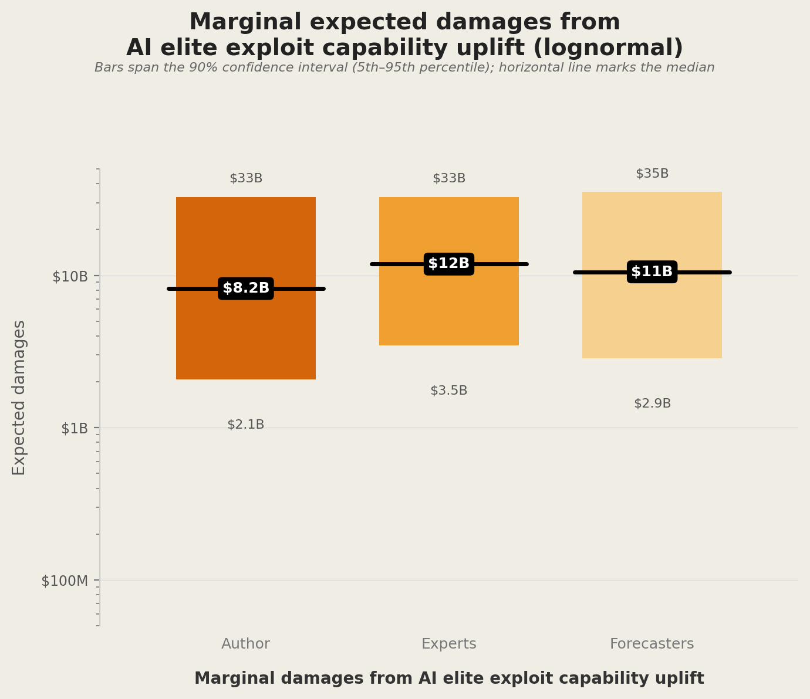
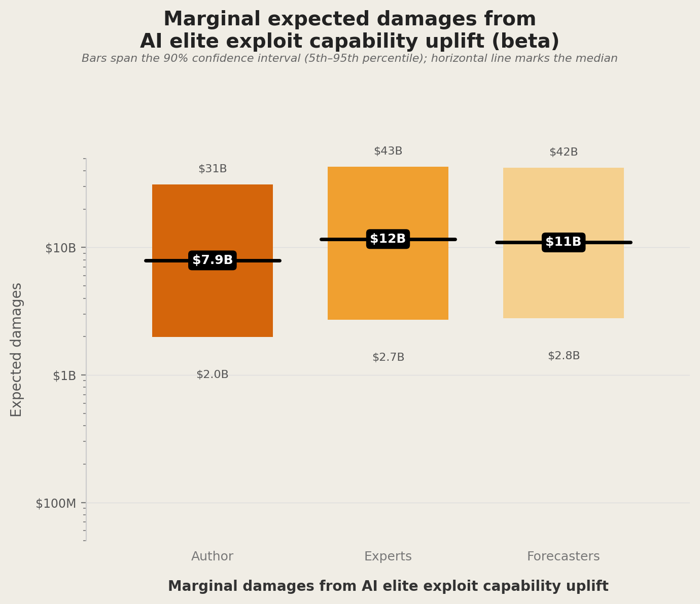
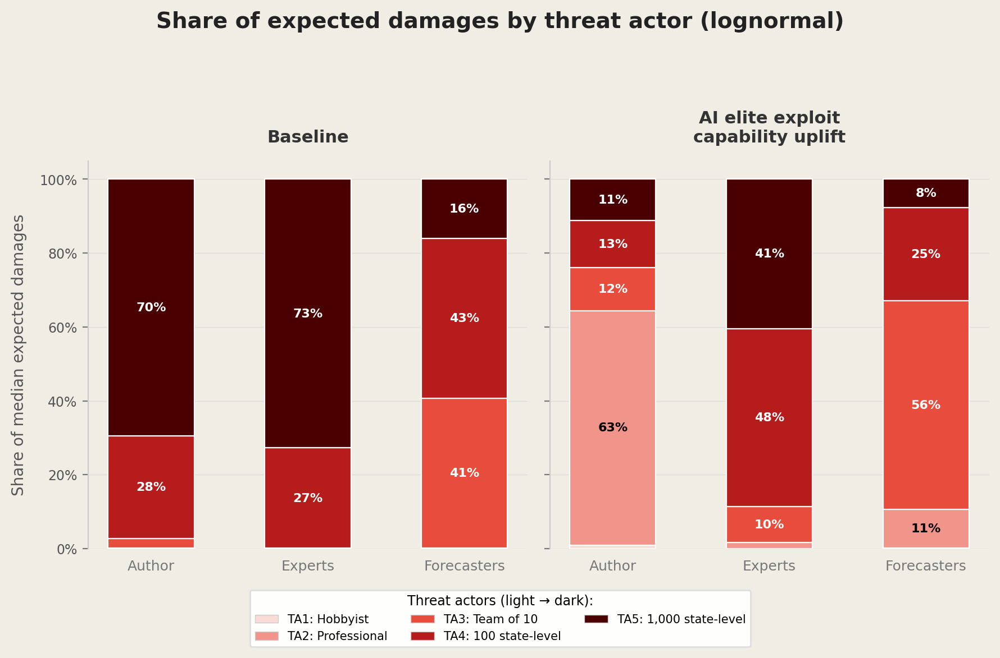
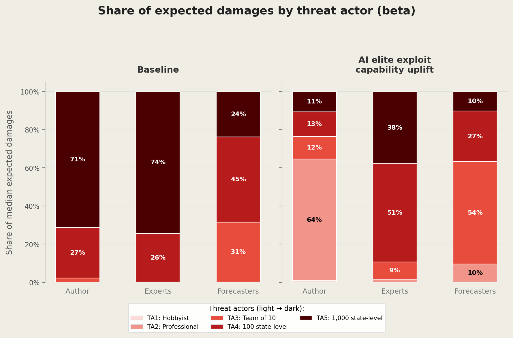

# Worm Damages Monte Carlo Simulation

Monte Carlo simulation estimating expected damages from at least one data-damaging worm attack, comparing a baseline scenario to a world conditional on "Capability 1" (frontier AI models enabling 25% of individual professional hackers to find vulnerabilities and write elite exploits).

## Method

For each of three estimator groups (Author, Experts, Forecasters) and five threat actor tiers, the script:

1. Fits distributions to (5th, 50th, 95th) percentile triplets for end-to-end capability, willingness, and potential damages per event
2. Draws 200,000 Monte Carlo samples
3. Computes per-sample: P(at least one worm) = 1 - &prod;(1 - capability_i &times; willingness_i) across all threat actors
4. Multiplies by sampled damages to get expected loss

This avoids the uncertainty amplification that arises from simply multiplying endpoint bounds of each parameter.

## Distribution choices

The simulation supports two distribution families for [0,1]-bounded parameters (capability and willingness):

- **Lognormal** (clipped to [0,1]): Simple and analytically tractable, but can clip a significant fraction of samples at the upper bound for near-1 parameters, compressing the distribution.
- **Beta**: Naturally respects [0,1] bounds without clipping, giving a more faithful representation of uncertainty for bounded probabilities.

Damages per event use a lognormal in both cases (positive, unbounded).

## Output

The script produces charts for both distribution choices:

### Baseline vs Conditional expected damages (lognormal)


### Baseline vs Conditional expected damages (beta)


### Marginal damages from AI uplift (lognormal)


### Marginal damages from AI uplift (beta)


### Threat actor share of expected damages (lognormal)


### Threat actor share of expected damages (beta)


## Usage

```bash
pip install numpy matplotlib scipy
python worm_damages_monte_carlo.py
```

## Data Source

Input data from the "Combined author and survey" tab of the worm damages spreadsheet (updated). End-to-end capability, willingness, and potential-damages-per-event triplets are taken as (5th percentile, median, 95th percentile). Potential damages per event are $10B (low) / ~$38.7B (geomean) / $150B (high). See the accompanying paper for full methodology.

## A note on the charts

In the baseline-vs-conditional and marginal charts, each coloured **bar spans the 90% confidence interval** (the 5th to 95th percentile of the Monte Carlo output) and the **horizontal line marks the median**. The threat-actor charts are 100%-stacked shares of median expected damages, not confidence intervals.
